class: center, middle

## Ces slides en ligne :

## `r paste0("joelgombin.github.io/", params$slug)`

---
class: inverse, center, middle

# Éléments d'évolution

---
## Une croissance historique...

.center[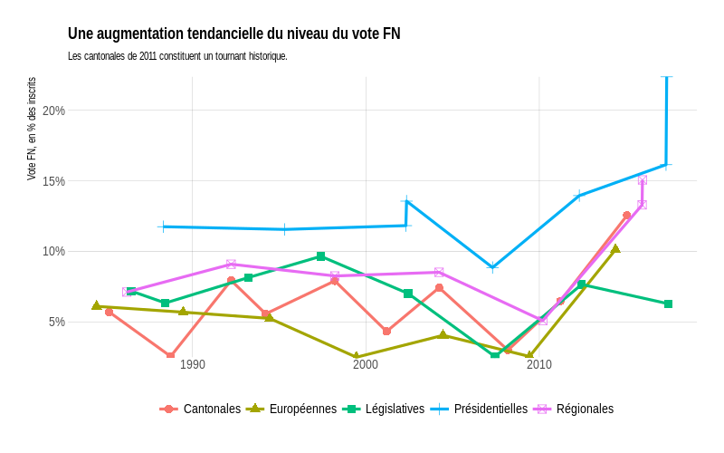]

---
## ...à tous les scrutins

.center[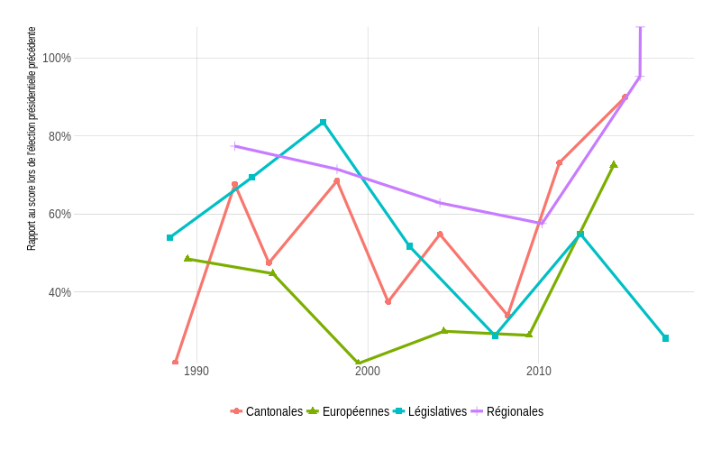]

---
```{r, echo=FALSE, out.width="600px", fig.align='center'}
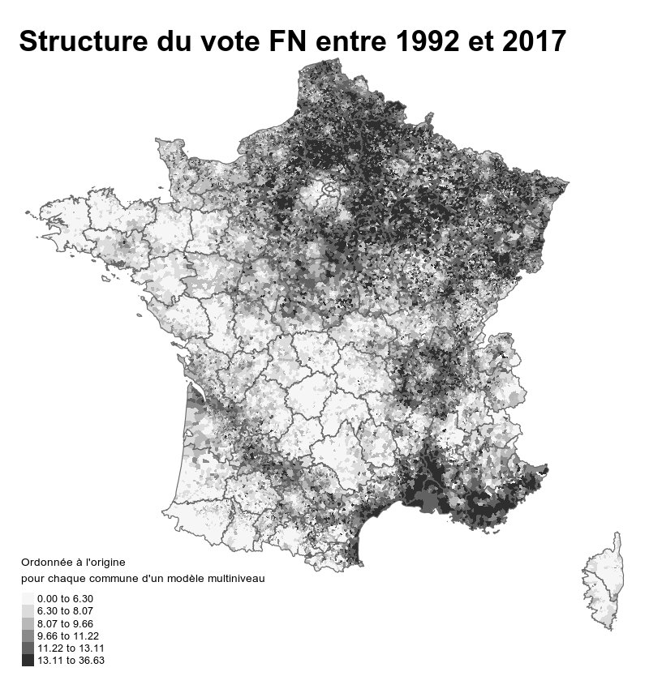
```


---
```{r, echo=FALSE, out.width="600px", fig.align='center'}
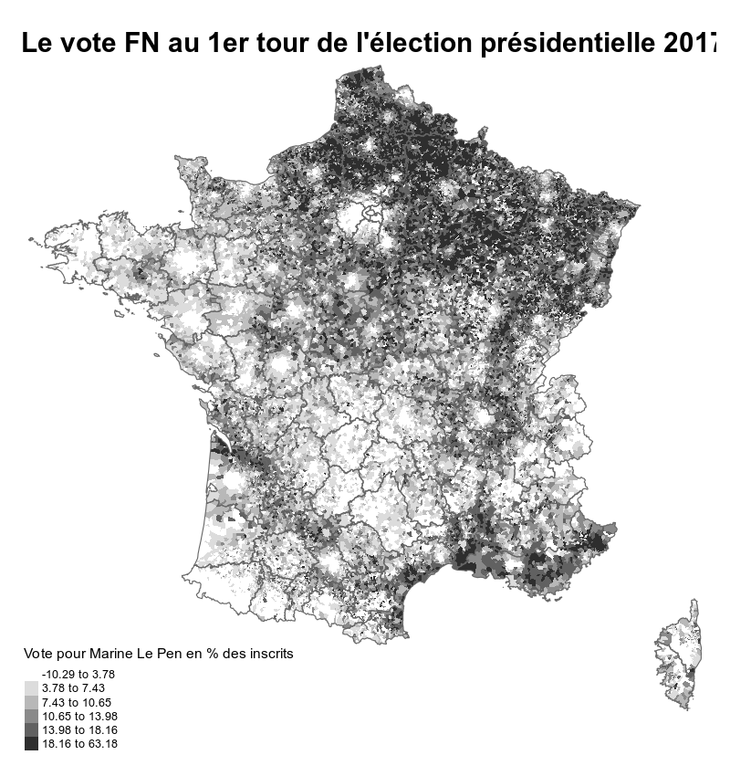
```

---
```{r, echo=FALSE, out.width="600px", fig.align='center'}
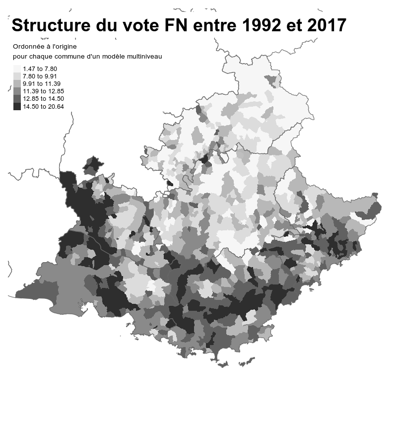
```


---
```{r, echo=FALSE, out.width="600px", fig.align='center'}
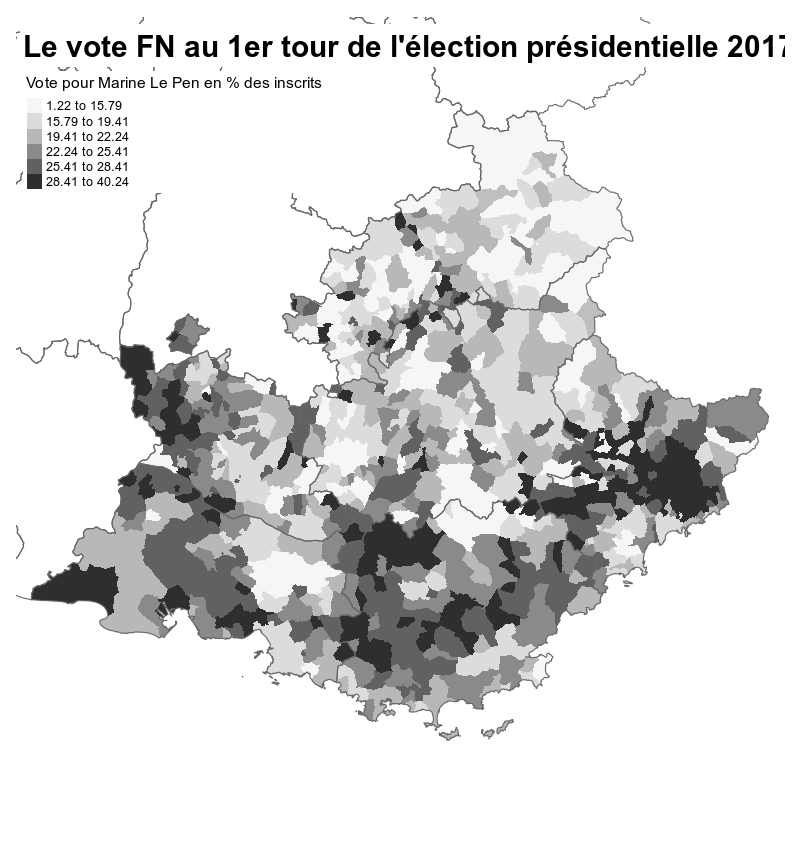
```


---
```{r, echo=FALSE, out.width="600px", fig.align='center'}
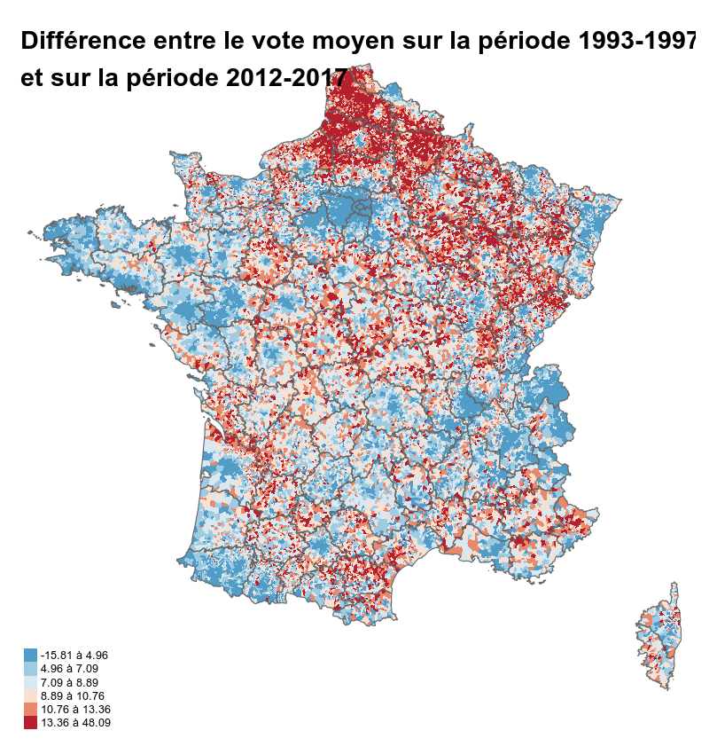
```

---
```{r, echo=FALSE, out.width="600px", fig.align='center'}
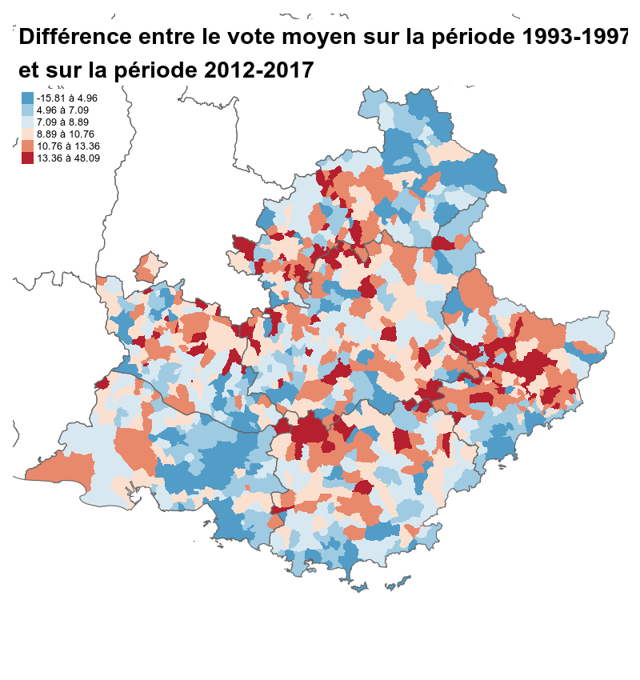
```


---
## Un rééquilibrage Nord-Sud ?

La religion comme facteur contextuel : le vote FN a le moins progressé là où le poids des religions minoritaires est le plus fort (*r* = -0,58). À l'inverse, le FN a plutôt plus progressé dans les départements où le catholicisme a été le moins affaibli. 


Facteurs également politiques et sociaux.

---
## Un ancrage territorial inégal

.center[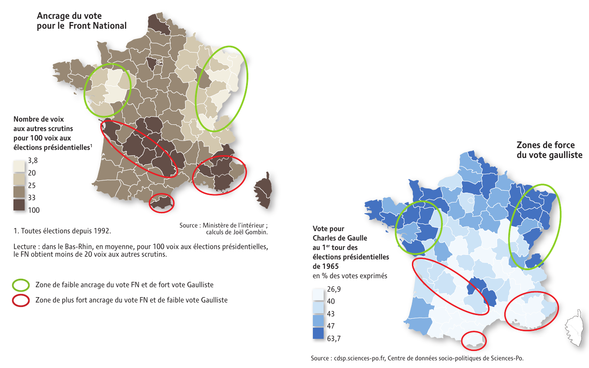]

---
## Le mythe du transfert PC -> FN

.center[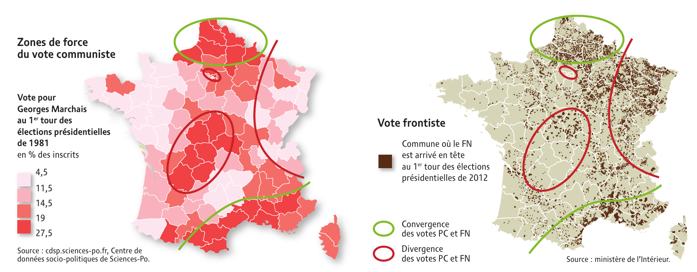]

---
## Une forte polarisation sociale

.center[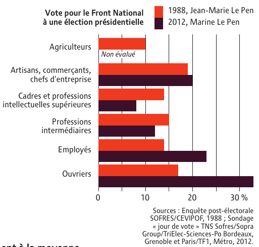]

---
## Une forte dimension générationnelle

Toute chose égale par ailleurs, le vote FN est plus fréquent chez les classes d'âge actives que chez les retraités. Chaque génération qui arrive sur le marché électoral a un rapport moins distancié au vote FN.

Pour autant, "la jeunesse" entretient un rapport hétérogène au vote FN.

.center[.reduite[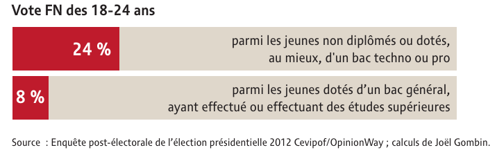]]

---
## Une forte polarisation sociale

.center[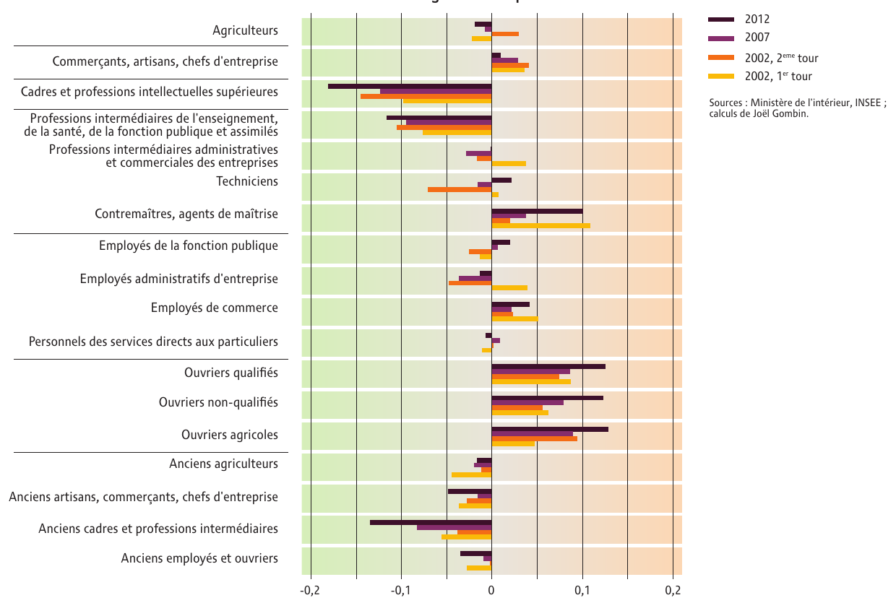]

---
```{r, echo=FALSE, out.width="800px", fig.align='center'}
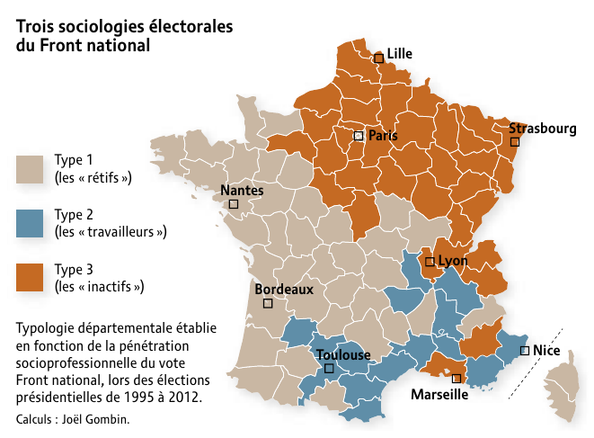
```

---

```{r, echo=FALSE, out.width="600px", fig.align='center'}
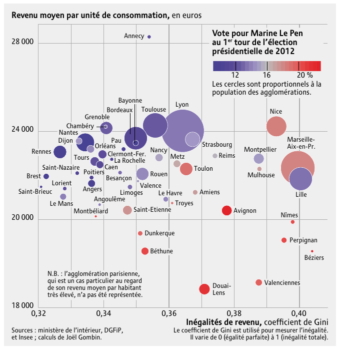
```


---

## Quid de l'avenir ?

- des fondamentaux qui n'ont pas bougé malgré les apparentes difficultés du FN à partir de 2017
- une polarisation autour du FN (et de LREM) renforcée
- un mouvement de banalisation, y compris dans certains secteurs de la gauche
- pour autant, une incapacité structurelle du RN à constituer un bloc majoritaire
- une inconnue sur la capacité du FN à renforcer son implantation locale malgré l'affaiblissement de l'appareil

---
## Comment lutter contre le RN ?

- l'enjeu majeur est celui de la maîtrise de l'agenda politique
- une grande difficulté des gauches à imposer leur propre agenda 
- d'une certaine manière, "lutter contre le RN" c'est encore le placer au centre du jeu...
- ... malgré les dangers d'une banalisation et du confusionnisme ambiant
- au fond, la question majeure est celle de la confiance, sociale et politique. Comment la rétablir ? 


---
class: inverse, center, middle

# Merci !

Contact : [joel.gombin@gmail.com](mailto:joel.gombin@gmail.com)


